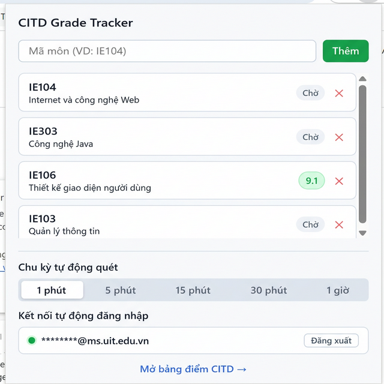

# CITD Grade Checker (CITD Mark Tracer Extension)

Công cụ tự đồng bộ và thông báo điểm số cho sinh viên CITD (Trung tâm Phát triển Công nghệ Thông tin - ĐHQG-HCM).

## 🚀 Giới thiệu
**CITD Grade Checker** là một Chrome Extension giúp sinh viên tự động theo dõi điểm số trên hệ thống [student.citd.edu.vn](https://student.citd.edu.vn). Với các tính năng tự động hóa mạnh mẽ, bạn sẽ không bao giờ bỏ lỡ bất kỳ cột điểm nào.

## 🌟 Tính năng nổi bật (v1.5)
- ✅ **Giao diện Popup hiện đại**: Quản lý danh sách môn học và tài khoản ngay trên thanh công cụ.
- ✅ **Chu kỳ tự động quét (Interval Selector)**: Tùy chỉnh thời gian kiểm tra điểm linh hoạt (1 phút, 5 phút, 15 phút, 30 phút, hoặc 1 giờ).
- ✅ **Auto-Login (Tự động đăng nhập)**: Tự động xử lý khi session hết hạn bằng thông tin tài khoản đã lưu.
- ✅ **Badge Count**: Hiển thị số lượng môn học có điểm mới trực tiếp trên icon extension.
- ✅ **Thông báo đẩy**: Gửi thông báo Windows/macOS ngay khi phát hiện thay đổi điểm số.
- ✅ **Cấu hình động**: Thêm/Xóa môn học cần theo dõi trực tiếp từ giao diện.

## 🛠 Công nghệ sử dụng (Tech Stack)
- **Manifest V3**: Tiêu chuẩn Chrome Extension hiện đại.
- **Service Worker (`background.js`)**: Chạy ngầm xử lý logic chính, Auto-Login và quản lý Alarms.
- **Offscreen Documents**: Phân giải HTML (DOM Parsing) an toàn.
- **Chrome Storage API**: Lưu trữ thông tin đăng nhập, danh sách môn học và chu kỳ quét.
- **Chrome Alarms & Notifications API**: Quản lý lịch trình kiểm tra và thông báo người dùng.

## 📖 Hướng dẫn sử dụng

### 1. Cài đặt
1. Tải mã nguồn dự án về máy.
2. Truy cập `chrome://extensions/`, bật **Developer mode**.
3. Chọn **Load unpacked** và trỏ đến thư mục dự án.

### 2. Thiết lập tài khoản & Chu kỳ quét
- **Tài khoản**: Nhập Email và Mật khẩu sinh viên tại phần "Kết nối tự động đăng nhập" và nhấn **Lưu tài khoản**.
- **Chu kỳ quét**: Chọn thời gian bạn muốn extension tự động kiểm tra điểm (mặc định là 1 phút). Extension sẽ tự động cập nhật lịch trình ngay khi bạn thay đổi.

### 3. Theo dõi môn học
- Nhập mã môn học (VD: `IE104`, `MA004`) vào ô "Mã môn" và nhấn **Thêm**.
- Trạng thái điểm số sẽ được đồng bộ và hiển thị trực quan:
  - **Chờ**: Đang đợi hệ thống cập nhật hoặc đang đồng bộ.
  - **Số điểm**: Hiển thị điểm số hiện tại khi phát hiện thành công.

## ⚠️ Lưu ý quan trọng
- **Bảo mật**: Thông tin tài khoản được lưu cục bộ trong trình duyệt của bạn (Chrome Storage), đảm bảo an toàn tuyệt đối.
- **Thông báo**: Để nhận thông báo đẩy, hãy đảm bảo bạn đã cấp quyền thông báo cho Chrome trên hệ điều hành.
- **Đồng bộ**: Khi bạn thay đổi chu kỳ quét, extension sẽ hủy lịch trình hiện tại và thiết lập lịch mới ngay lập tức.

---
*Phát triển bởi [lcdkhoa](https://github.com/lcdkhoa) with ❤️ (AI powered)*
